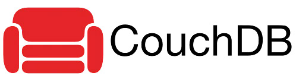

# WEB-Final-Research

<div dir="rtl">


<br>


<div dir="ltr">

``` js

```
</div>


<li></li>

<br>

<ol>
<p>• </p>
</ol>

<h2>مقدمه</h2>
<br>

سیستم مدیریت پایگاه داده مکانیزمی را برای ذخیره و بازیابی داده ها فراهم می کند. به طور کلی سه نوع اصلی سیستم مدیریت پایگاه داده وجود دارد که به خاتصار هر کدام را شرح میدهیم:

<li>RDBMS یا Relational Database management Systems : 
سیستم پایگاه داده ای است که بر اساس مدل رابطه ای پیاده سازی شده. اطلاعات در این مدل در اشیایی به نام جدول ذخیره میشوند. جدول مجموعه ای از ورودی های داده است و از ستون ها و ردیف ها تشکیل شده است که هر ستون بیانگر یک ویژگی آن شی است و سطر ها دیتا ها هستند.</li>

<li>OLAP:
Online Analytical Processing Server بر اساس مدل داده های چند بعدی است. این به مدیران و تحلیلگران اجازه می دهد تا از طریق دسترسی سریع، سازگار و تعاملی به اطلاعات، دید خوبی از اطلاعات بدست آورند.
</li>

<li>NoSQL Database:
پایگاه داده ای است که مکانیزمی را برای ذخیره و بازیابی داده ها به غیر از روابط جدولی مورد استفاده در پایگاه های داده رابطه ای فراهم می کند. به همین علت گاهی به نام Not Only SQL نیز شناخته میشود. این پایگاه‌های داده بدون schema هستند، API ساده دارند، در نهایت سازگاری هستند و می‌توانند حجم عظیمی از داده‌ها را مدیریت کنند.</li>

<br>

هدف اصلی یک پایگاه داده NoSQL داشتن موارد زیر است:
<ol>
<li>سادگی طراحی</li>
<li>مقیاس بندی افقی</li>
<li>در دسترس تر بودن</li>
</ol>

<br>

دیتابیس های NoSQL، از داده ساختار های متفاوتی نسبت به دیتابیس های رابطه ای استفاده میکنند و این امر موجب افزایش سرعت آن در برخی عملیات ها میشود. 
اولویت داشتن یک پایگاه داده NoSQL به مشکلی که باید حل کند بستگی دارد. 

<br>

این پایگاه داده ها هم داده های ساختاریافته و هم داده های بدون ساختار مانند فایل های صوتی، فایل های ویدئویی، اسناد و غیره را ذخیره می کنند.
پایگاه داده های nosql به سه دسته ی زیر تقسیم بندی میشوند:


<ol>
<li>
Key-value store:
این پایگاه‌های داده برای ذخیره داده‌ها در جفت‌های key-value طراحی شده‌اند و این پایگاه‌داده‌ها هیچ schema ای نخواهند داشت. در این پایگاه داده ها، هر مقدار داده از یک کلید و یک مقدار برای آن کلید تشکیل شده است.
مثال: BerkeleyDB, Cassandra, DynamoDB, Riak
</li>
<li>Column Store:
در این پایگاه‌داده‌ها، داده‌ها در سلول‌هایی که به صورت ستونی گروه بندی شده اند، ذخیره می‌شوند. این گروه ستون ها می توانند هر تعداد ستون را شامل شوند.
مثال: BigTable, HBase, and HyperTable.
</li>
<li>Document Store:
اینها پایگاه‌های داده‌ای هستند که بر اساس ایده اصلی key-value ایجاد شده‌اند که در آن اسناد حاوی داده‌های پیچیده‌تری هستند. در اینجا، به هر سند یک کلید منحصر به فرد اختصاص داده می شود که برای بازیابی آن استفاده می شود.
مثال: CouchDB and MongoDB
</li>
</ol>

<br>

<h2>CouchDB چیست؟</h2>

<p>CouchDB یک پایگاه داده منبع باز است که توسط بنیاد نرم افزار آپاچی توسعه یافته است. تمرکز آن بر سهولت استفاده است. و این پایگاه داده مبتنی بر مدل NoSQL است.

از JSON برای ذخیره داده ها، جاوا اسکریپت به عنوان زبان پرس و جوی اسناد و پروتکل http برای api برای دسترسی به اسناد است. درواقع یک برنامه چند وجهی است که در سال 2005 منتشر و در سال 2008 به یک پروژه آپاچی تبدیل شد.</p>

<br>

مزایا:

<ul>
<li>از HTTP API برای ارتباط آسان‌تر استفاده می‌شود</li>
<li>این دیتابیس می‌تواند هر نوع داده‌ای را ذخیره کند</li>
<li>ReduceMap امکان بهینه‌سازی ترکیب داده‌ها را فراهم می‌کند</li>
<li>ساختار CouchDB بسیار ساده است</li>
<li>indexing و بازیابی سریعی دارد</li>
</ul>

<br>

معایب:

<ul>
<li>CouchDB فضای زیادی برای overhead اشغال می‌کند، که یکی از مهم‌ترین معایب این دیتابیس در مقایسه با سایر دیتابیس‌ها به شما می‌رود</li>
<li>اجرای کوئری‌های Arbitrary، بسیار هزینه‌بر است</li>
<li>CouchDB در مقایسه با بقیه دیتابیس‌ها، overhead بیش‌تری ایجاد می‌کند</li>
<li>ممکن است Temporary viewها در مجموعه داده‌های عظیم بسیار کند باشند</li>
<li>از transactionها پشتیبانی نمی‌کند</li>
<li>ممکن است Replication در دیتابیس‌های بزرگ با شکست روبرو شود</li>
</ul>

<br>


ویژگی ها:

ویژگی Document Storage:
CouchDB یک پایگاه داده NoSQL است. این امکان ذخیره اسناد با نام های منحصر به فرد را فراهم می کند و همچنین یک API به نام RESTful HTTP API برای خواندن و به روز رسانی (افزودن، ویرایش، حذف) اسناد پایگاه داده ارائه می دهد.
در CouchDB، اسناد واحد اصلی داده ها هستند و همچنین شامل bigdata می شوند. فیلدهای سند منحصراً نامگذاری می شوند و حاوی مقادیری از انواع مختلف (متن، عدد، بولین، لیست ها و غیره) هستند و هیچ محدودیتی برای اندازه متن یا تعداد عناصر وجود ندارد.
به‌روزرسانی‌های سند (افزودن، ویرایش، حذف) از Atomicity پیروی می‌کنند، یعنی به طور کامل ذخیره می‌شوند یا اصلاً ذخیره نمی‌شوند. پایگاه داده هیچ سند جزئی ذخیره یا ویرایش شده ای نخواهد داشت.

<br>

فشرده سازی:
هر زمان که فضای فایل پایگاه داده بیش از حد معینی هدر شود، تمام داده های فعال در یک فایل جدید کپی می شوند (کلون می شوند). هنگامی که فرآیند کپی به طور کامل انجام شد، فایل قدیمی حذف خواهد شد. همه اینها با فرآیند فشرده سازی انجام می شود. پایگاه داده در طول فشرده سازی آنلاین باقی می ماند و همه به روز رسانی ها کامل انجام می شوند.

<br>

دید ها:
داده ها در CouchDB در اسناد نیمه ساختاریافته ای ذخیره می شوند که با ساختارهای implicit  منعطف هستند، اما این یک مدل ساده برای ذخیره سازی و به اشتراک گذاری داده ها است. اگر می‌خواهیم داده‌های خود را به روش‌های مختلف ببینیم، نیاز به فیلتر کردن، سازمان‌دهی و گزارش داده‌هایی که به جداول تجزیه نشده‌اند داریم.
برای حل این مشکل، CouchDB یک مدل view ارائه می دهد. View ها روشی برای جمع‌آوری و گزارش‌دهی اسناد در پایگاه داده هستند و بر اساس تقاضا برای جمع‌آوری، پیوستن و گزارش اسناد پایگاه داده ساخته می‌شوند. از آنجایی که نماها به صورت پویا ساخته می‌شوند و بر سند اصلی تأثیر نمی‌گذارند، می‌توانید به تعداد دلخواه نمایش‌های متفاوتی از همان داده‌ها داشته باشید.


<br>


<h3>نصب بر روی ویندوز:</h3>

<li>ابتدا از <a href="https://couchdb.apache.org/">اینجا</a> به وب سایت رسمی رفته و متناسب با سیستم عامل خودتان آن را دانلود کنید</li>

<br>

سپس از طریق فایل setup-couchdb-1.6.1_R16B02.exe آن را نصب کنید.

<br>

سپس وب اینترفیس آن را با رفتن به آدرس http://127.0.0.1:5984/ در مرورگر باز کنید.

<br>

اگر همه چیز درست پیش رفته باشد اطلاعات زیر را در آن میبینید:

<div dir="ltr">

``` js
{
   "couchdb":"Welcome","uuid":"c8d48ac61bb497f4692b346e0f400d60",
   "version":"1.6.1",
   "vendor":{
      "version":"1.6.1","name":"The Apache Software Foundation"
   }
}
```
</div>

<br>

برای تعامل با couchdb به آدرس زیر بروید:
<div dir="ltr">
http://127.0.0.1:5984/_utils/
</div>

<br>

نصب بر روی لینوکس با دستور زیر:

<div dir="ltr">

``` js
sudo aptitude install couchdb
# make && sudo make install
```
</div>

<br>

سپس برای راه اندازی آن دستورات زیر را وارد کنید:

<div dir="ltr">

``` js
$ cd apache-couchdb-1.6.1
$ cd etc
$ couchdb start
```
</div>

<br>

حال برای تعامل با اینترفیس به آدرس http://127.0.0.1:5984/ بروید

در آن جا اگر همه چیز درست انجام شده باشد همچین چیزی میبینید:


<div dir="ltr">

``` js
{
   "couchdb":"Welcome",
   "uuid":"8f0d59acd0e179f5e9f0075fa1f5e804",
   "version":"1.6.1",
   "vendor":{
      "name":"The Apache Software Foundation",
      "version":"1.6.1"
   }
}
```
</div>

<br>

<h3>ابزار cURL</h3>	

<br>

ابزار cURL راهی برای برقراری ارتباط با CouchDB است.
این ابزاری است برای انتقال داده ها از یا به سرور، با استفاده از یکی از پروتکل های پشتیبانی شده (HTTP، HTTPS، FTP، FTPS، TFTP، DICT، TELNET، LDAP یا FILE). این دستور طوری طراحی شده است که بدون تعامل کاربر کار کند. cURL مجموعه ای از ترفندهای مفید مانند پشتیبانی از پروکسی، احراز هویت کاربر، آپلود ftp، پست HTTP، اتصالات SSL (https:)، کوکی ها، رزومه انتقال فایل و موارد دیگر را ارائه می دهد.

<br>

ابزار cURL در سیستم عامل هایی مانند UNIX، Linux، Mac OS X و Windows موجود است. این یک ابزار خط فرمان است که با استفاده از آن کاربر می تواند مستقیماً از خط فرمان به پروتکل HTTP دسترسی پیدا کند. این فصل نحوه استفاده از ابزار cURL را به شما آموزش می دهد.

<br>

شما می توانید با استفاده از ابزار cURL به سادگی با تایپ کردن cURL و سپس آدرس وب سایت همانطور که در زیر نشان داده شده است به هر وب سایتی دسترسی پیدا کنید.

<br>


در زیر برخی از گزینه های مهم ابزار cURL از جمله موارد استفاده شده توسط CouchDB آورده شده است

<ul>
<li>-پرچم X
(HTTP) روش درخواست سفارشی مورد استفاده در هنگام برقراری ارتباط با سرور HTTP را مشخص می کند. درخواست مشخص شده به جای روشی که در غیر این صورت استفاده می شود (که پیش فرض GET است) استفاده می شود. برای جزئیات و توضیحات، مشخصات HTTP 1.1 را بخوانید.

(FTP) یک دستور FTP سفارشی را برای استفاده به جای LIST هنگام انجام لیست فایل ها با ftp مشخص می کند.
</li>
<li>-اچ
(HTTP) هنگام دریافت یک صفحه وب از هدر اضافی استفاده می شود. توجه داشته باشید که اگر یک سرصفحه سفارشی اضافه کنید که همان نام یکی از هدرهای داخلی است که cURL استفاده می کند، هدر تنظیم شده خارجی شما به جای هدر داخلی استفاده می شود. این به شما امکان می‌دهد حتی کار پیچیده‌تری نسبت به cURL انجام دهید. شما نباید هدرهای تنظیم شده داخلی را بدون اینکه کاملاً بدانید چه کاری انجام می دهید جایگزین کنید. جایگزین کردن هدر داخلی با هدر بدون محتوا در سمت راست کولون، از نمایش آن هدر جلوگیری می کند.

cURL اطمینان می دهد که هر سرصفحه ای که اضافه یا جایگزین می کنید با نشانگر انتهای خط مناسب ارسال می شود. نه باید آن را به عنوان بخشی از محتوای سرصفحه اضافه کنید و نه باید خطوط جدید یا بازگردانی‌هایی را به موارد بی نظم اضافه کنید.

همچنین گزینه های -A/--user-agent و -e/--referer را ببینید.

از این گزینه می توان چندین بار برای افزودن/جایگزینی/حذف هدرهای متعدد استفاده کرد
</li>
<li>پرچم -d
با استفاده از این پرچم cURL می توانید داده ها را به همراه درخواست HTTP POST به سرور ارسال کنید، گویی توسط کاربر در فرم پر شده و ارسال شده است.

مثال

فرض کنید یک وب‌سایت وجود دارد و می‌خواهید وارد آن شوید یا با استفاده از پرچم –d از ابزار cURL مانند زیر، داده‌هایی را به وب‌سایت ارسال کنید

<div dir="ltr">

``` js
$ curl -o example.html www.tutorialspoint.com/index.htm 
% Total % Received % Xferd Average Speed Time Time Time Current 
      Dload Upload Total Spent Left Speed
100 81193 0 81193 0 0 48168 0 --:--:-- 0:00:01 --:--:--
58077
```
</div>

این کد منبع صفحه اصلی tutorialspoint.com را دریافت می کند، یک فایل به نام example.com ایجاد می کند و خروجی را در فایلی به نام example.html ذخیره می کند

</li>

</ul>

<br>

<h3> Hello CouchDB</h3>

شما می توانید با ارسال یک درخواست GET به نمونه CouchDB نصب شده به صفحه اصلی CouchDB دسترسی پیدا کنید. اول از همه مطمئن شوید که CouchDB را در محیط لینوکس خود نصب کرده اید و با موفقیت اجرا می شود و سپس از دستور زیر برای ارسال درخواست دریافت به نمونه CouchDB استفاده کنید.

<div dir="ltr">

``` js
curl http://127.0.0.1:5984/
```
</div>

این به شما یک سند JSON مانند شکل زیر می دهد که در آن CouchDB جزئیاتی مانند شماره نسخه، نام فروشنده و نسخه نرم افزار را مشخص می کند

<div dir="ltr">

``` js
$ curl http://127.0.0.1:5984/
{
   "couchdb" : "Welcome",
   "uuid" : "8f0d59acd0e179f5e9f0075fa1f5e804",
   "version" : "1.6.1",
   "vendor" : {
      "name":"The Apache Software Foundation",
      "version":"1.6.1"
   }
}
```
</div>

<br>


<div dir="ltr">

``` js

```
</div>


<div dir="ltr">

``` js

```
</div>


<div dir="ltr">

``` js

```
</div>